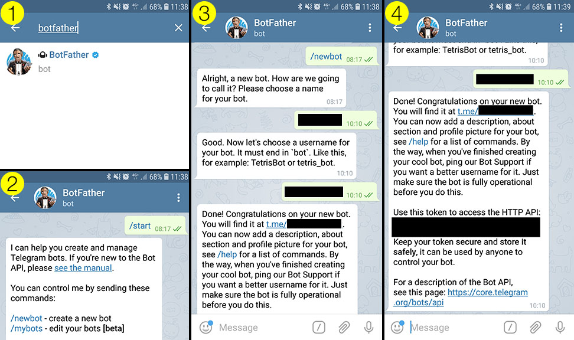

# telegram-boot-alert

A script for Raspberry Pi to announce it's IP address via Telegram on system start.

It is useful to be able to connect remotely to your Raspberry Pi via VNC or SSH, but to do so you need to know the IP address of your Raspberry Pi. This program will create a Telegram bot that will send you it's IP address when your Raspberry Pi is turned on.

# Setup

## Step 1 - Chat with the Bot Father

* Install the Telegram app if you don’t already have it
* When creating your account, you will need to allow the app to verify your phone number, but once that is done you can safely revoke that permission in your phone settings
* Not sure about iOS, but on Android it is safe to deny permission to import your contacts, access your photos etc (unless, of course, you want to send photos to your bot later)
* Following the screenshots below: Search for the BotFather account, send it a /newbot command, answer the questions and write down your API token.



## Step 2 - Add Python file to your Raspberry Pi

* Create the file `/home/pi/telegram-alert.py`
* Add your `TELEGRAM_TOKEN` to the Python file
* Run the Python program.
* Search for your bot on Telegram and send it a `/start` message. It will reply with your Telegram ID number.
* Add your Telegram ID number to the `OWNER_ID` of the Python file. This will ensure that it only sends the IP address to you.

## Step 3 - Set your Raspberry Pi to run the Python file on start up

* Use a text editor to open your `/etc/rc.local` file. From the terminal this can be done with 

```bash
sudo nano /etc/rc.local
```

* Scroll to the bottom of the file. 
* Insert a new line before `exit 0`
* Add this line to execute your Pyhton script

```bash
python3 /home/pi/telegram-alert.py
```

## Step 4 - Customise your Telegram bot

You could easily extend this bot to control your GPIO pins, or to send you a photo from the Pi Camera (nice secuity camera feature).

See my guide here for more of what you can do with your Telegram bot... [https://pbaumgarten.com/python/telegram.html](https://pbaumgarten.com/python/telegram.html)

